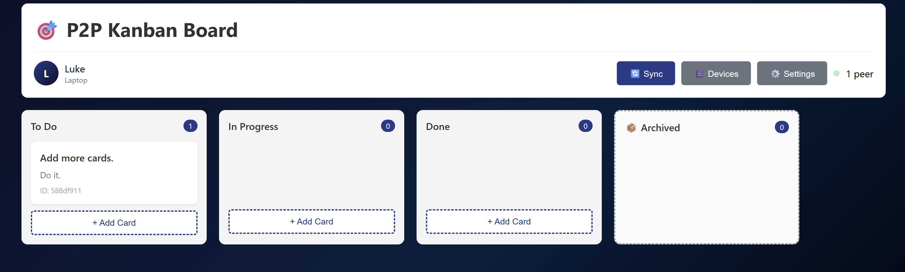

# P2P Kanban Board

A fully peer-to-peer Kanban board that syncs across devices without any central server. Built as a single HTML file with cryptographic authentication and real-time collaboration.



## ✨ Cool Features

### 🔐 Cryptographic Identity & Security
- **Web Crypto API** for ECDSA P-256 keypair generation
- Every user action is cryptographically signed
- Multi-device support - one user account, many devices
- No passwords, no logins, just public key cryptography

### 🔄 True Peer-to-Peer Sync
- **WebRTC DataChannels** for direct device-to-device communication
- Operation-based CRDT - longest valid history wins conflicts
- Real-time synchronization when peers are connected
- Works completely offline once the HTML file is loaded

### 🌐 Dual Discovery Modes

#### BroadcastChannel Mode (Same Machine)
- Zero configuration - just open multiple browser tabs
- Instant discovery across windows
- No server required

#### WebSocket Mode (LAN Discovery)
- Discovers devices across your local network
- Lightweight Python signaling server included
- True cross-computer collaboration

### 🎨 Beautiful Dark UI
- Sleek dark blue to black gradient background
- Smooth drag-and-drop interface
- Responsive design works on any screen size

### 💾 Local-First Architecture
- All data stored in browser localStorage
- Complete operation history with undo/replay capability
- Export/import functionality
- Your data never leaves your devices

### 🚀 Zero Dependencies
- Single HTML file - no build process, no npm install
- Works in any modern browser (Chrome, Firefox, Edge, Safari)
- Python signaling server uses only standard library
- Deploy by just opening the file or copying it to devices

## 🎯 How It Works

### Architecture

1. **Identity Layer**: Each device generates an ECDSA keypair. Users can add multiple devices to their account.

2. **Operation Log**: Every card creation, edit, or move is stored as a signed operation with timestamp and device ID.

3. **Conflict Resolution**: When peers sync, they exchange operation logs. The longest valid history (verified by signatures) becomes the canonical state.

4. **Discovery**: Devices broadcast presence announcements via BroadcastChannel (same browser) or WebSocket (network-wide).

5. **WebRTC Connection**: Once discovered, peers establish direct WebRTC DataChannel connections for low-latency sync.

## 🚦 Quick Start

### Option 1: Same-Machine Testing

1. Open `kanban-p2p.html` in your browser
2. Create your identity (name + device name)
3. Open another tab with the same file
4. Click "🔄 Sync" → "Start Scanning"
5. Connect to your other tab and watch them sync!

### Option 2: Network-Wide Sync

1. **Start the signaling server** on one computer:
   ```bash
   python3 signaling_server.py
   # Note the WebSocket URL it displays (e.g., ws://192.168.1.100:8765)
   ```

2. **Open the HTML file** on multiple devices on the same WiFi network

3. **Configure discovery**:
   - Click "🔄 Sync"
   - Enter the WebSocket URL in the signaling server field
   - Click "Start Scanning"

4. **Connect**: Click "Connect" next to discovered devices

5. **Collaborate**: Changes sync in real-time!

## 📋 Use Cases

- **Personal task management** across your laptop, desktop, and phone
- **Team collaboration** on a local network without internet
- **Offline-first workflows** - sync when you can, work when you can't
- **Privacy-focused projects** - your data never touches the cloud
- **Air-gapped environments** - perfect for secure networks

## 🔧 Technical Details

### Built With
- **Web Crypto API** for cryptographic operations
- **WebRTC DataChannels** for P2P communication
- **BroadcastChannel API** for same-origin discovery
- **WebSocket** for network discovery signaling
- **localStorage** for persistence
- **Vanilla JavaScript** - no frameworks!

### File Structure
```
kanban-p2p.html          # Single-file web application (all-in-one)
signaling_server.py      # Optional WebSocket signaling server
README.md                # This file
Screenshot_*.png         # Screenshot
```

### Data Format

Each operation is structured as:
```javascript
{
  id: "uuid",
  userId: "user-uuid",
  deviceId: "device-uuid",
  timestamp: 1234567890,
  action: {
    type: "add_card" | "update_card" | "move_card",
    // ... action-specific fields
  },
  signature: [/* ECDSA signature bytes */]
}
```

### Sync Protocol

1. **Presence Announcement**: Devices broadcast their identity every 2 seconds
2. **Discovery**: Other devices receive announcements and show available peers
3. **Connection**: User clicks "Connect" → WebRTC offer/answer exchange
4. **Sync Request**: Peers compare operation counts
5. **History Exchange**: Device with fewer operations requests missing ones
6. **Verification**: Each operation's signature is verified before applying
7. **Merge**: Operations are sorted by timestamp, deterministically ordered by device ID for ties
8. **Snapshot Rebuild**: Board state is reconstructed by replaying all operations

## 🛡️ Security Considerations

- **Signatures prevent tampering**: Operations can't be forged without the device's private key
- **No central authority**: No server to compromise
- **Local data only**: Nothing leaves your network
- **Trust on first use**: When you connect to a peer, you're trusting their public key

**Note**: This is designed for trusted local networks. For internet-wide collaboration, you'd want to add:
- TLS/DTLS for encrypted channels
- Certificate pinning
- User-level access control
- Revocation mechanisms

## 🎮 Advanced Usage

### Manual Connection (Fallback)

If automatic discovery doesn't work:

1. Click "🔄 Sync"
2. Expand "Advanced: Manual Connection"
3. One device creates a connection code
4. Share the code with another device
5. Second device generates a response code
6. First device enters the response code
7. Connected!

### Managing Devices

- Click "📱 Devices" to see all devices linked to your account
- Remove compromised or lost devices
- Each device has its own keypair, signed by your master key

### Export/Import

- Click "⚙️ Settings" → "📥 Export Data" to backup your board
- Share the JSON file to clone your board to another device
- Store it as a backup in case you clear browser data

## 🐛 Troubleshooting

**Devices not discovering each other?**
- Make sure both devices have the Sync panel open and scanning
- Check they're on the same WiFi network
- Try entering the signaling server URL manually
- Firewall might be blocking WebSocket connections

**Connection fails?**
- Check that both devices can reach the signaling server
- Try the manual connection method
- NAT/firewall issues might require TURN server configuration

**Data not syncing?**
- Verify the connection shows "Connected" (green indicator)
- Check browser console for errors
- Operations might be invalid - check signatures are verifying

## 📄 License

This is a demonstration project. Feel free to use, modify, and distribute as you see fit.

## 🙏 Acknowledgments

Built with inspiration from:
- Conflict-free Replicated Data Types (CRDTs)
- WebRTC P2P communication patterns
- Local-first software principles
- The beauty of single-file applications

---

**Pro tip**: Bookmark the HTML file for instant access to your synced Kanban board from anywhere! 🚀
